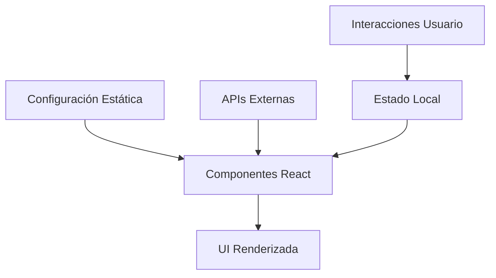

# Arquitectura del Sistema - Sonora La Cuca

## Introducción

El sitio web de Sonora La Cuca ha sido diseñado siguiendo los principios de arquitectura moderna de aplicaciones web, priorizando el rendimiento, la escalabilidad y la experiencia del usuario. Esta documentación detalla las decisiones arquitectónicas, patrones de diseño implementados y la estructura técnica del proyecto.

## Visión General de la Arquitectura

### Stack Tecnológico Principal

La aplicación está construida sobre una base tecnológica sólida que combina las mejores herramientas del ecosistema React y Next.js:

**Frontend Framework:**
- Next.js 15.3.5 con App Router
- React 18 con Server Components
- TypeScript para type safety

**Styling y UI:**
- Tailwind CSS para estilos utilitarios
- Framer Motion para animaciones
- Diseño responsive mobile-first

**Desarrollo y Tooling:**
- ESLint para linting
- PostCSS para procesamiento de CSS
- Configuración optimizada de TypeScript

### Arquitectura de Componentes

El proyecto sigue una arquitectura de componentes modular y escalable, organizados en las siguientes categorías:

#### 1. Layout Components
Componentes responsables de la estructura general de la aplicación:
- `Header`: Navegación principal con menú responsive
- `Footer`: Información de contacto y enlaces
- `PageTransition`: Transiciones suaves entre páginas
- `Preloader`: Pantalla de carga inicial

#### 2. Feature Components
Componentes específicos para funcionalidades de la banda:
- `Hero`: Sección principal de bienvenida
- `WelcomeAudioPlayer`: Reproductor de audio interactivo
- `ChatWidget`: Widget de chat para interacción con usuarios
- `ContactTemplate`: Template para emails de contacto

#### 3. UI Components
Componentes reutilizables de interfaz:
- `SocialIcons`: Iconos de redes sociales optimizados
- `Guirnaldas`: Elementos decorativos animados

### Patrón de Arquitectura

El proyecto implementa una arquitectura basada en los siguientes patrones:

#### Server-Side Rendering (SSR) y Static Site Generation (SSG)
- Páginas estáticas generadas en build time para mejor SEO
- Server Components para optimización de rendimiento
- Hydration selectiva para interactividad

#### Component Composition Pattern
- Componentes pequeños y enfocados en una responsabilidad
- Composición sobre herencia
- Props drilling minimizado mediante context cuando es necesario

#### Configuration-Driven Development
- Configuraciones centralizadas en archivos dedicados
- Separación clara entre datos y lógica de presentación
- Facilita el mantenimiento y actualizaciones

## Estructura de Directorios

```
src/
├── app/                    # App Router de Next.js
│   ├── api/               # API Routes
│   ├── blog/              # Páginas del blog
│   ├── globals.css        # Estilos globales
│   ├── layout.tsx         # Layout raíz
│   └── page.tsx           # Página principal
├── components/            # Componentes React
│   ├── audio/            # Componentes de audio
│   ├── contact/          # Componentes de contacto
│   ├── decorations/      # Elementos decorativos
│   ├── emails/           # Templates de email
│   ├── home/             # Componentes de la página principal
│   ├── icons/            # Iconos SVG
│   └── layout/           # Componentes de layout
├── config/               # Configuraciones
│   ├── blog.ts           # Configuración del blog
│   ├── discography.ts    # Datos de discografía
│   ├── site.ts           # Configuración general
│   └── tour.ts           # Datos de gira
└── types/                # Definiciones de tipos TypeScript
```

### Principios de Organización

1. **Separación por Funcionalidad**: Los componentes se agrupan por su función específica
2. **Configuración Centralizada**: Todos los datos configurables están en archivos dedicados
3. **Tipado Fuerte**: Uso extensivo de TypeScript para prevenir errores
4. **Modularidad**: Cada componente es independiente y reutilizable

## Gestión del Estado

### Estado Local
- React Hooks (useState, useEffect) para estado de componentes
- Estado mínimo y derivado cuando es posible
- Lifting state up cuando múltiples componentes necesitan el mismo estado

### Estado Global
- No se requiere gestión de estado global compleja
- Context API para casos específicos como tema o configuración de usuario
- Props drilling controlado mediante composición de componentes

## Optimizaciones de Rendimiento

### Optimizaciones de Imagen
- Next.js Image component para lazy loading automático
- Optimización automática de formatos (WebP, AVIF)
- Responsive images con srcset automático

### Optimizaciones de Código
- Tree shaking automático con Next.js
- Code splitting por rutas
- Dynamic imports para componentes pesados

### Optimizaciones de Red
- Static generation para contenido que no cambia frecuentemente
- Compresión automática de assets
- CDN-ready con optimizaciones de caché

## Seguridad

### Medidas Implementadas
- Sanitización automática de inputs en formularios
- Validación tanto en cliente como servidor
- Headers de seguridad configurados
- HTTPS enforced en producción

### Buenas Prácticas
- No exposición de secrets en el frontend
- Validación de tipos en runtime para APIs
- Rate limiting en endpoints sensibles

## Escalabilidad

### Preparación para Crecimiento
- Arquitectura modular que permite agregar nuevas funcionalidades
- Separación clara entre datos y presentación
- APIs diseñadas para extensibilidad

### Consideraciones Futuras
- Preparado para migración a micro-frontends si es necesario
- Estructura compatible con CMS headless
- Diseño API-first para futuras integraciones

---

*Esta arquitectura ha sido diseñada para balancear simplicidad, rendimiento y mantenibilidad, proporcionando una base sólida para el crecimiento futuro del proyecto.*


## Patrones de Diseño Implementados

### 1. Compound Component Pattern

El proyecto utiliza el patrón de componentes compuestos para crear interfaces flexibles y reutilizables. Este patrón es especialmente visible en componentes como el `AlbumCard` en la página de música, donde diferentes partes del componente pueden ser compuestas según las necesidades.

```typescript
// Ejemplo de uso del patrón
<AlbumCard album={album}>
  <AlbumCard.Cover />
  <AlbumCard.Info />
  <AlbumCard.TrackList />
  <AlbumCard.StreamingLinks />
</AlbumCard>
```

**Beneficios:**
- Flexibilidad en la composición de UI
- Reutilización de lógica común
- Mantenimiento simplificado

### 2. Provider Pattern

Aunque el proyecto actual no requiere estado global complejo, está preparado para implementar el patrón Provider para funcionalidades futuras como:

- Gestión de tema (dark/light mode)
- Configuración de usuario
- Estado de autenticación

```typescript
// Estructura preparada para providers
<ThemeProvider>
  <UserProvider>
    <App />
  </UserProvider>
</ThemeProvider>
```

### 3. Custom Hooks Pattern

Los hooks personalizados encapsulan lógica reutilizable y efectos secundarios:

```typescript
// Ejemplo de hook personalizado para audio
const useAudioPlayer = (audioSrc: string) => {
  const [isPlaying, setIsPlaying] = useState(false);
  const [duration, setDuration] = useState(0);
  
  // Lógica del reproductor...
  
  return { isPlaying, duration, play, pause, stop };
};
```

### 4. Configuration Object Pattern

Toda la configuración del sitio está centralizada en objetos de configuración, facilitando el mantenimiento y las actualizaciones:

```typescript
// src/config/site.ts
export const siteConfig = {
  socials: { /* ... */ },
  contact: { /* ... */ },
  bandMembers: [ /* ... */ ]
};
```

## Arquitectura de Datos

### Estructura de Datos

El proyecto maneja diferentes tipos de datos estructurados:

#### 1. Datos de Configuración
- **Miembros de la banda**: Información estática sobre los integrantes
- **Enlaces de navegación**: Estructura del menú principal
- **Redes sociales**: URLs y configuración de plataformas

#### 2. Datos de Contenido
- **Discografía**: Álbumes, canciones y enlaces de streaming
- **Fechas de gira**: Eventos, venues y estado de tickets
- **Blog posts**: Artículos y noticias de la banda

#### 3. Datos de Interacción
- **Formularios de contacto**: Validación y envío
- **Estado de UI**: Menús, modales y transiciones

### Flujo de Datos



El flujo de datos sigue un patrón unidireccional:
1. Los datos de configuración se cargan al inicio
2. Los componentes reciben datos como props
3. Las interacciones del usuario actualizan el estado local
4. Los cambios de estado re-renderizan la UI

## Arquitectura de Estilos

### Sistema de Diseño

El proyecto implementa un sistema de diseño coherente basado en:

#### Variables de Marca
```css
:root {
  --brand-dark: #1a1a1a;
  --brand-primary: #c59d42;
  --brand-accent: #e94560;
  --brand-secondary: #2d2d2d;
}
```

#### Tipografía
- **Fuente Principal**: Inter (sans-serif)
- **Fuente de Marca**: Playfair Display (serif)
- **Jerarquía**: Escalas consistentes para headings y body text

#### Espaciado y Layout
- **Grid System**: CSS Grid y Flexbox
- **Breakpoints**: Mobile-first responsive design
- **Spacing Scale**: Basado en múltiplos de 4px

### Metodología CSS

El proyecto utiliza Tailwind CSS con un enfoque utility-first, complementado con:

1. **Componentes Personalizados**: Para patrones repetitivos
2. **Utilities Extendidas**: Clases personalizadas para la marca
3. **Responsive Design**: Breakpoints consistentes

```css
/* Ejemplo de utilidades personalizadas */
.btn-primary {
  @apply bg-brand-accent text-white px-6 py-3 rounded-lg font-medium;
  @apply hover:bg-brand-accent/80 transition-colors duration-200;
}
```

## Arquitectura de Animaciones

### Sistema de Animaciones

Las animaciones están implementadas usando Framer Motion con un enfoque sistemático:

#### 1. Transiciones de Página
```typescript
const pageVariants = {
  initial: { opacity: 0, y: 20 },
  animate: { opacity: 1, y: 0 },
  exit: { opacity: 0, y: -20 }
};
```

#### 2. Animaciones de Entrada
- **Fade In**: Para contenido que aparece
- **Slide Up**: Para elementos que emergen desde abajo
- **Scale**: Para elementos que necesitan énfasis

#### 3. Micro-interacciones
- **Hover Effects**: Feedback visual en botones y enlaces
- **Loading States**: Indicadores de progreso
- **State Changes**: Transiciones suaves entre estados

### Performance de Animaciones

- **GPU Acceleration**: Uso de transform y opacity
- **Reduced Motion**: Respeto por preferencias de accesibilidad
- **Lazy Loading**: Animaciones solo cuando son visibles

## Consideraciones de Accesibilidad

### Implementaciones Actuales

1. **Navegación por Teclado**: Todos los elementos interactivos son accesibles
2. **Screen Readers**: Etiquetas ARIA y texto alternativo
3. **Contraste**: Colores que cumplen con WCAG 2.1 AA
4. **Responsive**: Funciona en todos los tamaños de pantalla

### Mejoras Futuras

- **Skip Links**: Para navegación rápida
- **Focus Management**: Mejor gestión del foco en SPAs
- **Voice Navigation**: Compatibilidad con comandos de voz

---

*Esta arquitectura proporciona una base sólida y escalable para el sitio web de Sonora La Cuca, balanceando rendimiento, mantenibilidad y experiencia del usuario.*

